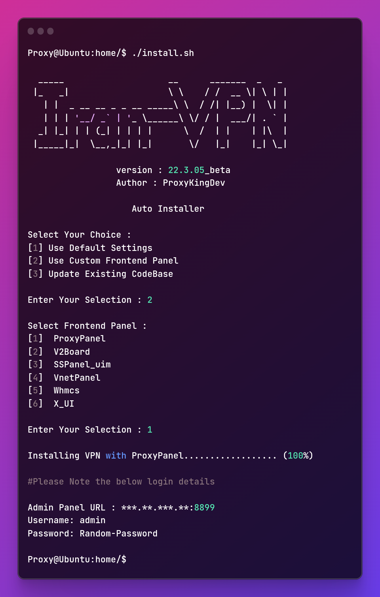
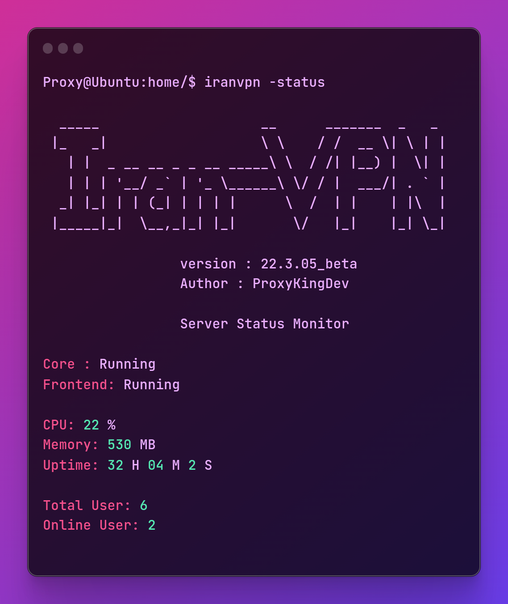

<h1 align="center">Hi 👋, I'm VPN/Proxy Tool Developer</h1>

<h3 align="center">Bypass Iran Censorship. The Ultimate VPN for Iran</h3>

This tool perfectly works inside iran on all networks. 

<h3 align="center">Price $200 - Lifetime License</h3>

Payment Method : Cryptocurrency

 

 <a href="https://commerce.coinbase.com/checkout/81d45993-e208-49f1-a50c-f2a52089afe0" target="_blank" rel="noreferrer">  

 

  

<h3 align="center" > Special Features </h3>

- Custom UDP/TCP Packet Muxer
- Auto rotate protocol
- Auto daily signature evasion mechanism update
- Daily Auto update encryption key
- Supports Multicast/Unicast
- Supports Google TCP-BBR
- Supports MultiPath TCP (MPTCP)
- Multi Server Support
- One Click Server Change. 
- Per User Speed Limit Feature
- Multiple Frontend Support
- Upto 1000 users (4GB Ram 4Core CPU)

<h3 align="center">System Requirements</h3>

 ⭐ **Debian 9+** or **Ubuntu 18.04+** ⭐

<h3 align="center">Languages used in this VPN</h3>

   

